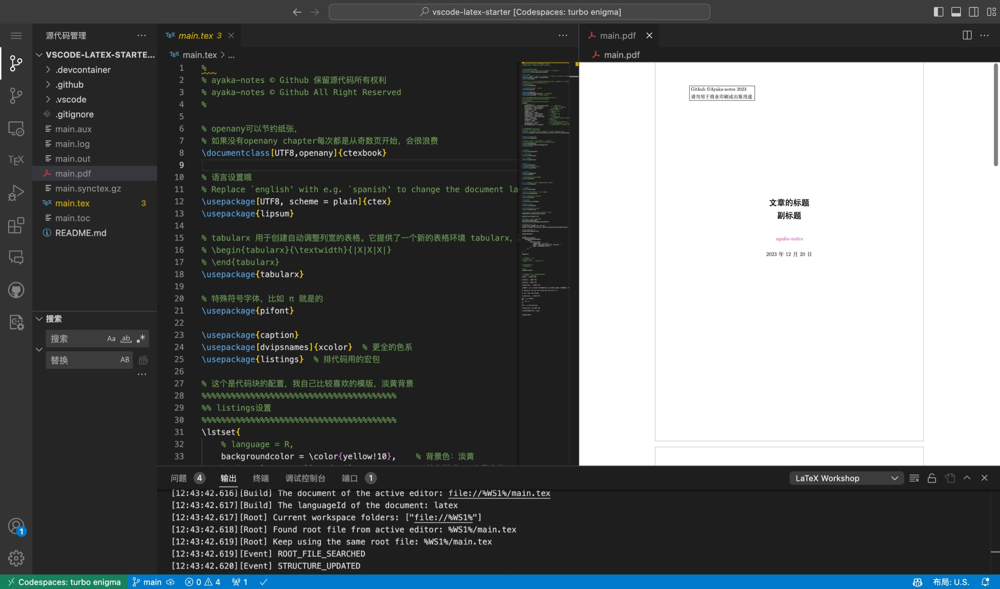

# vscode-latex-starter
Latex，启动！轻松在VSCode里面用容器编写Latex！
> 注意：本仓库带有Codespace的Cache缓存，**点击下面的链接**可以实现毫秒级光速Codespace启动！无需等待拉取Docker镜像。

## 启动寄巧

### 使用Github CodeSpace

如下所示，点击上面的 Create Codespace按钮，然后等待Github Codespace自动拉取容器，创建环境。这一步时间比较久。然后点击任意一个tex文件，或者创建任意一个tex文件，激活TexWorkshop拓展！接下来就可以愉快的 $\LaTeX\$

> 常见问题01：没有看到Tex的选项卡怎么办？
> 
> 解决方案01：打开任意一个`.tex`的文件就可以**激活插件**

### 使用本地VS Code

在本地VSCode里面克隆仓库。

